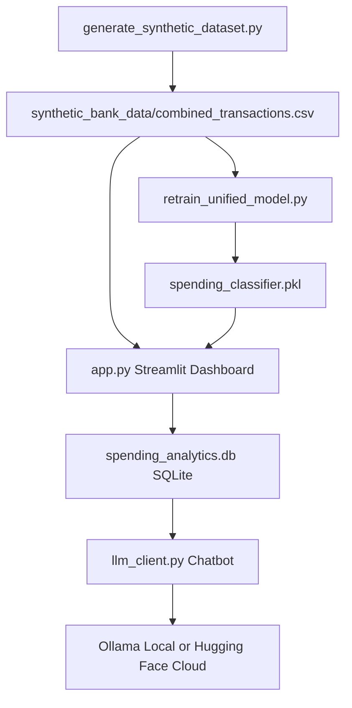

# Spending Analytics Data Mining Project

This refactor uses one synthetic dataset pipeline instead of many profile-specific CSV files.

## Quick Start

Run the project locally in this order:

```bash
python generate_synthetic_dataset.py
python retrain_unified_model.py
streamlit run app.py
```

Expected outputs:

- `synthetic_bank_data/combined_transactions.csv`
- `spending_classifier.pkl`
- `spending_analytics.db`
- Streamlit dashboard

## Architecture



## Project Structure

```text
.
+-- app.py
+-- data_utils.py
+-- database.py
+-- generate_demo_dataset.py
+-- generate_synthetic_dataset.py
+-- llm_client.py
+-- paths.py
+-- retrain_unified_model.py
+-- requirements.txt
+-- synthetic_bank_data/
|   +-- combined_transactions.csv
|   +-- demo_transactions.csv
+-- spending_analytics.db
+-- spending_classifier.pkl
```

## Setup

```bash
python -m venv .venv
.venv\Scripts\activate
pip install -r requirements.txt
```

## Generate the Synthetic Dataset

```bash
python generate_synthetic_dataset.py
```

The generator creates realistic transactions for:

- Profiles: Student, Professional, Family
- Years: 2024, 2025, 2026
- Banks: RBC, TD, Scotiabank
- Columns: date, merchant, description, amount, category, profile, bank, currency

Expenses are negative and income is positive.

Final category taxonomy:

- Income
- Housing
- Groceries
- Dining
- Coffee
- Transportation
- Utilities
- Subscriptions
- Shopping
- Healthcare
- Education
- Childcare
- Insurance
- Travel
- Savings/Investments

## Demo Dataset Generator

The project supports two dataset modes:

- Deterministic mode: `generate_synthetic_dataset.py` creates `synthetic_bank_data/combined_transactions.csv`. This is reproducible and should be used for grading, retraining, and final evaluation.
- Demo mode: `generate_demo_dataset.py` creates `synthetic_bank_data/demo_transactions.csv`. This is randomized and useful for presentations, chatbot demos, and showing that the app works with changing data.

Generate a demo dataset from the command line:

```bash
python generate_demo_dataset.py
```

Use a seed when you want a reproducible demo:

```bash
python generate_demo_dataset.py --seed 123 --transactions-per-profile 1000
```

In Streamlit, open the `Dataset Generator` page to:

- Select profiles, banks, and years
- Choose transactions per profile
- Optionally enter a random seed
- Generate `demo_transactions.csv`
- Load the demo dataset into SQLite
- Restore the original deterministic dataset from `combined_transactions.csv`

The demo generator does not modify `combined_transactions.csv`, `retrain_unified_model.py`, or `spending_classifier.pkl`.

## Retrain the Unified Model

```bash
python retrain_unified_model.py
```

The model trains from `synthetic_bank_data/combined_transactions.csv` and saves `spending_classifier.pkl`.
It preserves feature engineering, scaling, label encoding, Random Forest classification, and model persistence.

## Run Locally with Streamlit

```bash
streamlit run app.py
```

The app includes:

- Upload page
- Dashboard with filters and visualizations
- Database page with record counts, date range, profile/bank/category summaries, full table, and CSV export
- Dataset Generator page for randomized demo datasets
- SQLite database loading
- LLM chatbot page
- Local synthetic dataset fallback

## Local LLM Mode with Ollama

Install Ollama, pull a model, then run:

```bash
ollama pull phi3
# or
ollama pull mistral

ollama serve
streamlit run app.py
```

Verify installed models with:

```bash
ollama list
```

The application automatically detects locally installed Ollama models and displays them in a dropdown menu. In the Chatbot page, choose `Ollama` and select one of the detected local models.

## Cloud Mode with Hugging Face

For Streamlit Cloud:

1. Add all project files to GitHub.
2. Set the app entry point to `app.py`.
3. Add this Streamlit secret:

```toml
HF_TOKEN = "your_hugging_face_token"
```

4. In the Chatbot page, choose `Hugging Face`.

The code also supports `HF_TOKEN` from a local environment variable.

## Artificial Intelligence Components

The Random Forest classifier and the chatbot are separate AI components. The classifier predicts transaction categories, while the chatbot converts natural-language questions into SQL queries.

### Machine Learning Component

- Random Forest Classifier
- Predicts transaction categories
- Uses feature engineering, TF-IDF, scaling, and label encoding
- Trained from `combined_transactions.csv`
- Evaluated using classification metrics

### LLM Component

The chatbot supports three modes.

#### Heuristic Mode

- Rule-based SQL generation
- No external LLM required
- Fast and deterministic

#### Ollama Mode

- Local LLM execution
- Models discovered automatically from installed Ollama models
- Generates SQL queries against SQLite

#### Hugging Face Mode

- Cloud-hosted LLM
- Requires `HF_TOKEN`
- Generates SQL queries against SQLite

## Chatbot Examples

The chatbot converts natural language into safe SQLite `SELECT` queries. These questions are covered by deterministic fallback logic and can also be handled by Ollama or Hugging Face:

- How much did I spend on transportation?
- How much did I spend on groceries last month?
- Show my Starbucks transactions.
- What did I spend in March 2025?
- What are my top merchants?
- What are my top categories?
- What is my average transaction amount?
- What are my recurring payments?
- Compare January and February spending.
- What is my largest expense category?
- How many transactions do I have?
- What did the Family profile spend on groceries?
- How much did I spend with TD?
- How much did I spend by bank?
- What did I spend by month?
- How much income did I receive?
- How much income did I receive in 2026?

Only `SELECT` queries are allowed. Database writes are blocked from chatbot execution.

## Notes for Course Submission

This project remains a Data Mining pipeline:

- Synthetic data generation
- Data preprocessing
- Feature engineering
- Supervised ML classification
- Model evaluation
- Streamlit dashboard
- SQLite persistence
- LLM-assisted natural language analytics
